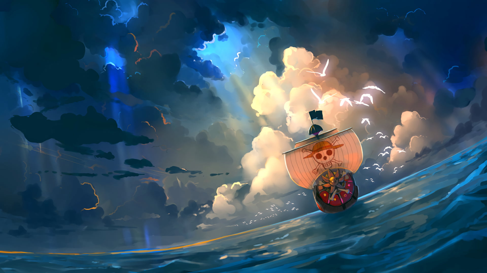

<!-- ========================= -->
<!--        INTRO / TÍTULO     -->
<!-- ========================= -->

  

<!-- ========================= -->
<!--       TEXTO ANIMADO       -->
<!-- ========================= -->

  

 

<!-- ========================= -->
<!--        ONE PIECE          -->
<!-- ========================= -->

  

 

<!-- ========================= -->
<!--     EFEITO CYBER NEON     -->
<!-- ========================= -->

  

 

<!-- ========================= -->
<!--     TECNOLOGIAS           -->
<!-- ========================= -->

<h2 align="center">
  ⚡ Tecnologias & Habilidades
</h2>

  

  

  

  

  

  

  

  

 

<!-- ========================= -->
<!--       CYBER FOOTER        -->
<!-- ========================= -->

  

<picture>
  <source media="(prefers-color-scheme: dark)" srcset="https://raw.githubusercontent.com/vliviav1223-spec/vliviav1223-spec/output/github-snake-dark.svg" />
  <source media="(prefers-color-scheme: light)" srcset="https://raw.githubusercontent.com/vliviav1223-spec/vliviav1223-spec/output/github-snake.svg" />
  
</picture>
