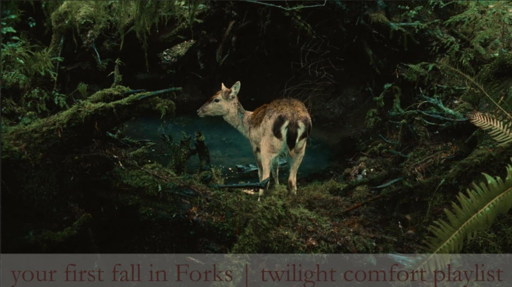

  

  

  

 

  

 

  

 

  

 

  
  
  
  
  
  
  
  

 

  

 

  

<picture>
  <source media="(prefers-color-scheme: dark)" srcset="https://raw.githubusercontent.com/vliviav1223-spec/vliviav1223-spec/output/github-snake-dark.svg" />
  <source media="(prefers-color-scheme: light)" srcset="https://raw.githubusercontent.com/vliviav1223-spec/vliviav1223-spec/output/github-snake.svg" />
  
</picture>
