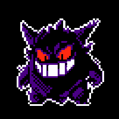
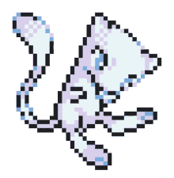

  

  

  

 

  

<table align="center" width="78%">
<tr>

<td width="42%" align="center" bgcolor="#0A0F18">

 

  

<b>✦ LIVIA ✦</b>

 

CYBER MAGE

  

<b>LV.</b> 20  <b>CLASS:</b> Cybersecurity Mage  <b>ALIGNMENT:</b> Digital Explorer  <b>REGION:</b> The Web 

 

</td>

<td width="58%" bgcolor="#0D1420">

 

<b>⚔ CHARACTER STATS ⚔</b>

<b>HP</b>   ██████████████████░░  

<b>MP</b>   ███████████████░░░░░  

<b>XP</b>   ███████████░░░░░░░░░

  

<b>INT</b>   ████████████████░░   86  <b>CODE</b> █████████████████░   91  <b>SEC</b>   ███████████████░░░   84  <b>MAGIC</b> ██████████████░░░░   79

  

「 The code is my spellbook. 」 

</td>

</tr>
</table>

 

 

  
    ⚡ PIKACHU USED THUNDER CODE! ⚡
  

 

  

<table align="center" width="78%">
<tr>
<td bgcolor="#0A0F18">

### ⚔ MAIN QUEST

> **Become a Full Stack Developer**

`████████████████░░░░` `80%`

 

### 🛡 ACTIVE QUESTS

* `☑` Study Cybersecurity
* `☑` Explore Web Development
* `☑` Build secure applications
* `☐` Master Full Stack Development
* `☐` Create something legendary

 

### 🔮 SIDE QUEST

> Explore the unknown parts of the digital realm.

`STATUS: ACTIVE`

</td>
</tr>
</table>

 

  

 

  

 

  

 

  

<table align="center" width="78%">
<tr>

<td align="center" bgcolor="#0A0F18">

⚔

 

<b>CODE BLADE</b>
 
Programming

</td>

<td align="center" bgcolor="#0A0F18">

🛡

 

<b>SECURITY SHIELD</b>
 
Cybersecurity

</td>

<td align="center" bgcolor="#0A0F18">

🔮

 

<b>MAGIC CORE</b>
 
Creativity

</td>

<td align="center" bgcolor="#0A0F18">

📜

 

<b>ANCIENT SCROLL</b>
 
Knowledge

</td>

</tr>
</table>

  

  

  

 

<table align="center" width="78%">
<tr>
<td bgcolor="#05080D">

<pre>

┌──────────────────────────────────────────────────────┐
│                                                      │
│   $ ./livia_adventure                               │
│                                                      │
│   [████████████████████████████████████████] 100%   │
│                                                      │
│   INITIALIZING MAGIC...             OK        │
│   LOADING SKILLS...                 OK        │
│   LOADING CYBERSECURITY...          OK        │
│   SUMMONING CODE...                 OK        │
│                                                      │
│   PLAYER READY.                                    │
│                                                      │
│   > ENTER THE DIGITAL REALM_                        │
│                                                      │
└──────────────────────────────────────────────────────┘

</pre>

</td>
</tr>
</table>

 

  

  
    ★ ACHIEVEMENT UNLOCKED ★
  

  
    <b>THE ADVENTURE HAS JUST BEGUN.</b>
  

 

  

  
    ✦ made with insomnia, code, curiosity & a little bit of magic ✦
  

  

<picture>
  <source media="(prefers-color-scheme: dark)" srcset="https://raw.githubusercontent.com/vliviav1223-spec/vliviav1223-spec/output/github-snake-dark.svg" />
  <source media="(prefers-color-scheme: light)" srcset="https://raw.githubusercontent.com/vliviav1223-spec/vliviav1223-spec/output/github-snake.svg" />
  
</picture>
